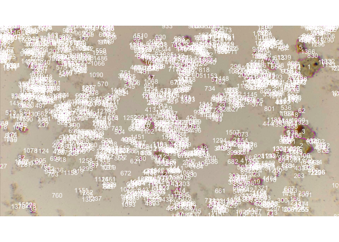
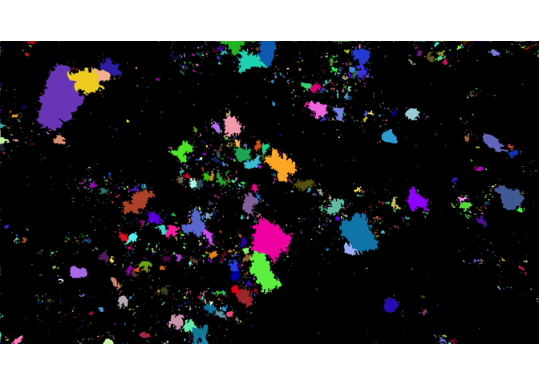

Análisis De imágenes de células
================
Karen Oróstica
March 3, 2021

# Estudio de imágenes de células

Las imágenes analizadas en este reporte corresponden células vegetales
tomadas desde un microscopio. Estas imágenes se tomaron una muestra
bioestimulante algal procesada a diferentes presiones de operación: 0,
300, 700, 800, 1000 y 1200 bares. Para este proposito se utilizó el
paquete **EBImage** de R.

## Metodología de análisis imágenes

1.  leer cada imagen en R usando la función **readImage()**, luego se
    extrajo el canal “azul” para su posterior procesamiento.

2.  Extrar las intensidades de píxeles usando **imageData()** y hacer la
    imagen inversa.

3.  Eliminar el fondo que contiene valores de intensidad pequeños (en
    este documento \<0.5), y de nuevo ajustar las formas morfológicas y
    eliminar el ruido.

4.Aplicar la función **computeFeatures()** para recuperar las
características morfológicas, incluida el área.

5.  Comparar las áreas bajo distintas presiones (0, 300, 700, 800, 1000,
    1200 bares).

### Análisis de imagen M3

``` r
library(EBImage)

# leer imagen
picM3 <- readImage("images/M3.jpeg")
display(picM3)
```

<!-- -->

``` r
# extraer el canal azul
pic.data <- imageData(channel(picM3, mode = "blue"))
pic.data <- 1 - pic.data  # reverse the image 
hist(pic.data)
```

<!-- -->

``` r
# filtro 
pic.data[pic.data < .5] <- 0
pic.data[pic.data >= .5] <- 1
pic.lab <- bwlabel(pic.data)  # attempt to enclose the holes
pic.lab <- fillHull(pic.lab)  
kern <- makeBrush(1, shape = "disc", step = F)
pic.lab <- erode(pic.lab, kern)  # remove only a few noisy pixels

######
##identificación celular
nmask = watershed( distmap(pic.lab), 2 )
display(colorLabels(nmask), all=TRUE)
```

<!-- -->

``` r
x = bwlabel(nmask) 
fts = computeFeatures.shape(x)

#Números clusters o celulas encontradas
nucNo <- max(bwlabel(nmask))
nucNo
```

    ## [1] 2115

``` r
#computeFeatures(x, picM3)
res = paintObjects(nmask, picM3, col='#ff00ff')

fts = computeFeatures.moment(nmask)
display(res, method="raster")
text(fts[,"m.cx"], fts[,"m.cy"], labels=seq_len(nrow(fts)), col="white", cex=.8)
```

<!-- -->

``` r
#######
# calcular el  área total
pic.shape <- computeFeatures.shape(nmask)

#guardar en data el area de cada punto
write.table(pic.shape, "data/area_M3.txt", sep="\t", row.names = F, col.names = T)

total.area_M3 <- sum(pic.shape[, "s.area"])
total.area_M3
```

    ## [1] 115625

### Análisis de imagen 4

``` r
#leer imagen
picM4 <- readImage("images/M4.jpeg")
display(picM4)
```

<!-- -->

``` r
# extraer el canal azul
pic.data <- imageData(channel(picM4, mode = "blue"))
pic.data <- 1 - pic.data  # reverse the image 
hist(pic.data)
```

<!-- -->

``` r
#filtro
pic.data[pic.data < .5] <- 0
pic.data[pic.data >= .5] <- 1
pic.lab <- bwlabel(pic.data)  # attempt to enclose the holes
pic.lab <- fillHull(pic.lab)  
kern <- makeBrush(1, shape = "disc", step = F)
pic.lab <- erode(pic.lab, kern)  # remove only a few noisy pixels

######
nmask = watershed( distmap(pic.lab), 2 )
display(colorLabels(nmask), all=TRUE)
```

<!-- -->

``` r
x = bwlabel(nmask) 
fts = computeFeatures.shape(x)

#Números clusters y células
nucNo <- max(bwlabel(nmask))
nucNo
```

    ## [1] 2495

``` r
res = paintObjects(nmask, picM4, col='#ff00ff')

fts = computeFeatures.moment(nmask)
display(res, method="raster")
text(fts[,"m.cx"], fts[,"m.cy"], labels=seq_len(nrow(fts)), col="white", cex=.8)
```

<!-- -->

``` r
#######
# calcular el  área total
pic.shape <- computeFeatures.shape(nmask)

#guardar en data el area de cada punto
write.table(pic.shape, "data/area_M4.txt", sep="\t", row.names = F, col.names = T)

total.area_M4 <- sum(pic.shape[, "s.area"])
total.area_M4
```

    ## [1] 82176

### Análisis de imagen 5

``` r
#leer imagen
picM5 <- readImage("images/M5.jpeg")
display(picM5)
```

<!-- -->

``` r
# extraer el canal azul
pic.data <- imageData(channel(picM5, mode = "blue"))
pic.data <- 1 - pic.data  # reverse the image 
hist(pic.data)
```

<!-- -->

``` r
#filtro
pic.data[pic.data < .5] <- 0
pic.data[pic.data >= .5] <- 1
pic.lab <- bwlabel(pic.data)  # attempt to enclose the holes
pic.lab <- fillHull(pic.lab)  
kern    <- makeBrush(1, shape = "disc", step = F)
pic.lab <- erode(pic.lab, kern)  # remove only a few noisy pixels


nmask = watershed( distmap(pic.lab), 2 )
display(colorLabels(nmask), all=TRUE)
```

<!-- -->

``` r
x = bwlabel(nmask) 
fts = computeFeatures.shape(x)

#Números de clusters y células
nucNo <- max(bwlabel(nmask))
nucNo
```

    ## [1] 1190

``` r
res = paintObjects(nmask, picM5, col='#ff00ff')

fts = computeFeatures.moment(nmask)
display(res, method="raster")
text(fts[,"m.cx"], fts[,"m.cy"], labels=seq_len(nrow(fts)), col="white", cex=.8)
```

<!-- -->

``` r
#######
# calcular area total
pic.shape     <- computeFeatures.shape(nmask)
#guardar en data el area de cada punto
write.table(pic.shape, "data/area_M5.txt", sep="\t", row.names = F, col.names = T)

total.area_M5 <- sum(pic.shape[, "s.area"])
total.area_M5
```

    ## [1] 132558

### Análisis de imagen 6

``` r
# leer imagen
picM6 <- readImage("images/M6.jpeg")
display(picM6)
```

<!-- -->

``` r
# extraer el canal azul
pic.data <- imageData(channel(picM6, mode = "blue"))
pic.data <- 1 - pic.data  # reverse the image 
hist(pic.data)
```

<!-- -->

``` r
# Filtro
pic.data[pic.data < .5] <- 0
pic.data[pic.data >= .5] <- 1
pic.lab <- bwlabel(pic.data)  # attempt to enclose the holes
pic.lab <- fillHull(pic.lab)  
kern    <- makeBrush(1, shape = "disc", step = F)
pic.lab <- erode(pic.lab, kern)  # remove only a few noisy pixels

######
nmask = watershed( distmap(pic.lab), 2 )
display(colorLabels(nmask), all=TRUE)
```

<!-- -->

``` r
x = bwlabel(nmask) 
fts = computeFeatures.shape(x)

#Numeros de clusters y células
nucNo <- max(bwlabel(nmask))
nucNo
```

    ## [1] 1555

``` r
res = paintObjects(nmask, picM6, col='#ff00ff')

fts = computeFeatures.moment(nmask)
display(res, method="raster")
text(fts[,"m.cx"], fts[,"m.cy"], labels=seq_len(nrow(fts)), col="white", cex=.8)
```

<!-- -->

``` r
#######
# calcular area total
pic.shape     <- computeFeatures.shape(nmask)
#guardar en data el area de cada punto
write.table(pic.shape, "data/area_M6.txt", sep="\t", row.names = F, col.names = T)


total.area_M6 <- sum(pic.shape[, "s.area"])
total.area_M6
```

    ## [1] 145360

### análisis de imagen 7

``` r
#leer iamgen
picM7 <- readImage("images/M7.jpeg")
display(picM7)
```

<!-- -->

``` r
# extraer el canal azul
pic.data <- imageData(channel(picM7, mode = "blue"))
pic.data <- 1 - pic.data  # reverse the image 
hist(pic.data)
```

<!-- -->

``` r
# Filtro
pic.data[pic.data < .5] <- 0
pic.data[pic.data >= .5] <- 1
pic.lab <- bwlabel(pic.data)  # attempt to enclose the holes
pic.lab <- fillHull(pic.lab)  
kern    <- makeBrush(1, shape = "disc", step = F)
pic.lab <- erode(pic.lab, kern)  # remove only a few noisy pixels

######
nmask = watershed( distmap(pic.lab), 2 )
display(colorLabels(nmask), all=TRUE)
```

<!-- -->

``` r
x = bwlabel(nmask) 
fts = computeFeatures.shape(x)

#Números de cluster o células
nucNo <- max(bwlabel(nmask))
nucNo
```

    ## [1] 2625

``` r
res = paintObjects(nmask, picM7, col='#ff00ff')

fts = computeFeatures.moment(nmask)
display(res, method="raster")
text(fts[,"m.cx"], fts[,"m.cy"], labels=seq_len(nrow(fts)), col="white", cex=.8)
```

<!-- -->

``` r
#######
# calcular area total
pic.shape     <- computeFeatures.shape(nmask)
#guardar en data el area de cada punto
write.table(pic.shape, "data/area_M7.txt", sep="\t", row.names = F, col.names = T)

total.area_M7 <- sum(pic.shape[, "s.area"])
total.area_M7
```

    ## [1] 248290

### Análisis de imagen 10

``` r
# leer imagen
picM10 <- readImage("images/M10.jpeg")
display(picM10)
```

<!-- -->

``` r
# extraer canal azul
pic.data <- imageData(channel(picM10, mode = "blue"))
pic.data <- 1 - pic.data  # reverse the image 
hist(pic.data)
```

<!-- -->

``` r
# filtro
pic.data[pic.data < .5] <- 0
pic.data[pic.data >= .5] <- 1
pic.lab <- bwlabel(pic.data)  # attempt to enclose the holes
pic.lab <- fillHull(pic.lab)  
kern    <- makeBrush(1, shape = "disc", step = F)
pic.lab <- erode(pic.lab, kern)  # remove only a few noisy pixels


nmask = watershed( distmap(pic.lab), 2 )
display(colorLabels(nmask), all=TRUE)
```

<!-- -->

``` r
x = bwlabel(nmask) 
fts = computeFeatures.shape(x)

#Números de cluster y células
nucNo <- max(bwlabel(nmask))
nucNo
```

    ## [1] 1092

``` r
res = paintObjects(nmask, picM10, col='#ff00ff')

fts = computeFeatures.moment(nmask)
display(res, method="raster")
text(fts[,"m.cx"], fts[,"m.cy"], labels=seq_len(nrow(fts)), col="white", cex=.8)
```

<!-- -->

``` r
#######
# calcular área total
pic.shape      <- computeFeatures.shape(nmask)

#guardar en data el area de cada punto
write.table(pic.shape, "data/area_M10.txt", sep="\t", row.names = F, col.names = T)

total.area_M10 <- sum(pic.shape[, "s.area"])
total.area_M10
```

    ## [1] 130050

### Análisis del área de las imágenes

``` r
data_areas   <-as.data.frame(t(data.frame(total.area_M3, total.area_M4, 
              total.area_M5, total.area_M6, total.area_M7, total.area_M10)))


data_areas$bar    <-c(0, 300, 700, 800,1000, 1200)
data_areas$labels <-c("M3", "M4", "M5", "M6", "M7", "M10")
colnames(data_areas)<-c ("Area", "Presion", "Muestra")

# data.frame resumen con area y presión
data_areas 
```

    ##                  Area Presion Muestra
    ## total.area_M3  115625       0      M3
    ## total.area_M4   82176     300      M4
    ## total.area_M5  132558     700      M5
    ## total.area_M6  145360     800      M6
    ## total.area_M7  248290    1000      M7
    ## total.area_M10 130050    1200     M10

``` r
#guardar data
write.table("data/area_presion_total.txt", sep="\t", row.names = F, col.names = T)
```

    ## "x"
    ## "data/area_presion_total.txt"

``` r
#liberias
library(ggplot2)
library(ggpubr)
```

    ## 
    ## Attaching package: 'ggpubr'

    ## The following object is masked from 'package:EBImage':
    ## 
    ##     rotate

``` r
# scatter plot
ggplot(data_areas, aes(x=Area, y=Presion)) + 
   geom_point()+
  geom_smooth(method=lm)+
    stat_cor(method = "pearson", label.x = 100000, label.y = 2000)+
  geom_text(aes(label=Muestra),hjust=0, vjust=0)
```

    ## `geom_smooth()` using formula 'y ~ x'

<!-- -->
